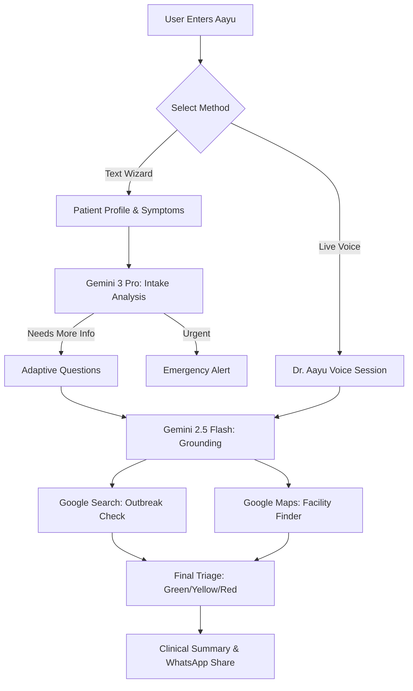

# Aayu (SwasthyaTriage) 🩺

**Aayu** is a high-fidelity, mobile-first health self-triage assistant designed for the Indian context. It helps individuals and frontline health workers (like ASHA workers) instantly decode symptoms into safe, actionable urgency guidance—helping users decide whether to rest at home, visit a clinic, or rush to the emergency room.

---

## 📸 App Interface (Conceptual)

| Home Screen | AI Interview | Live Voice Assistant | Triage Result |
| :---: | :---: | :---: | :---: |
| ) | ) | ) | ) |

---

## 🔄 How It Works (Workflow)

---

## 🌟 Key Features

- **Adaptive AI Interview**: Uses `gemini-3-pro-preview` to dynamically generate follow-up questions based on the patient's specific profile and symptoms, replacing rigid, static forms.
- **Dr. Aayu Live Voice Assistant**: A low-latency conversational interface powered by the **Gemini Live API** (`gemini-2.5-flash-native-audio`). It allows users with lower literacy to speak naturally with the AI in English or Hindi.
- **Grounded Triage Logic**: Leverages **Google Search and Google Maps grounding** to validate triage decisions against real-time regional contexts (e.g., identifying a Dengue outbreak in a specific city) and locating the nearest verified health facilities.
- **Bilingual Experience**: Fully localized UI and AI logic for both **English** and **Hindi**, ensuring accessibility across diverse Indian demographics.
- **Clinician-Ready Summaries**: Generates concise, professional clinical summaries that users can copy or share directly via WhatsApp with their doctors.
- **Offline-First UI**: A responsive, mobile-optimised interface built with a focus on speed and clarity in stressful health situations.

---

## 🚀 Gemini API Integration

Aayu utilizes a sophisticated multi-model pipeline to ensure safety and accuracy:

1.  **Phase 1: Intake Analysis (`gemini-3-pro-preview`)**
    - Analyzes initial patient profile and symptoms.
    - Determines if immediate emergency protocols are needed or if follow-up questions are required.
    
2.  **Phase 2: Contextual Grounding (`gemini-2.5-flash` + Tools)**
    - Uses `googleSearch` to check for local health advisories and weather patterns.
    - Uses `googleMaps` to provide actual links to nearby hospitals and clinics.
    
3.  **Phase 3: Real-Time Interaction (Gemini Live API)**
    - Streams audio data for natural bidirectional conversation.
    - Uses **Function Calling** (`recordTriageResult`) to autonomously finalize the clinical report during a voice session.

---

## 🛠️ Tech Stack

- **Frontend**: React (ESM), Tailwind CSS
- **AI/ML**: `@google/genai` SDK (Gemini 3 Pro, 2.5 Flash, Multimodal Live API)
- **Mapping**: Leaflet.js with OpenStreetMap
- **State Management**: React Hooks & LocalStorage for triage history

---

## 📦 Getting Started

### Prerequisites
- A Google Gemini API Key (set as `API_KEY` in your environment).

### Usage
1. Open the application.
2. Select your preferred language (English or Hindi).
3. Choose either the **Standard Check** (Text-based wizard) or **Voice Triage** (Live conversation).
4. Follow the guidance provided (Green: Home Care, Yellow: Clinic Visit, Red: Emergency).

---

## ⚖️ Medical Disclaimer

*Aayu is an AI-powered health assistant and is **not** a substitute for professional medical advice, diagnosis, or treatment. It is a triage guidance tool designed to assist in decision-making. Always consult a qualified physician for medical concerns.*

---

*Built with ❤️ for a Healthier India.*
